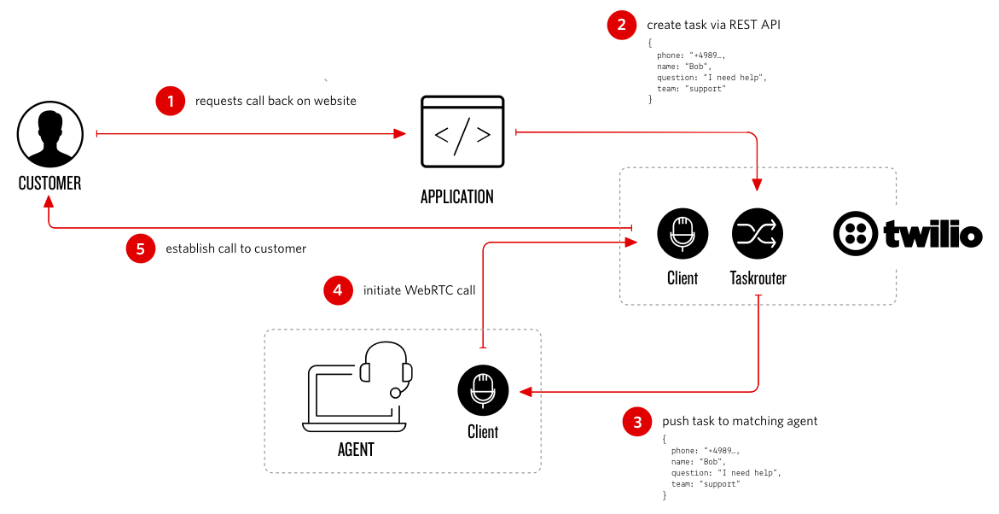
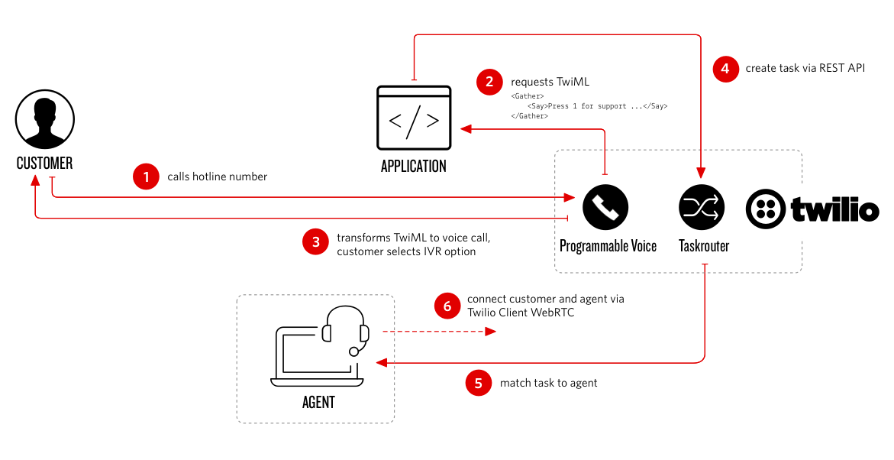
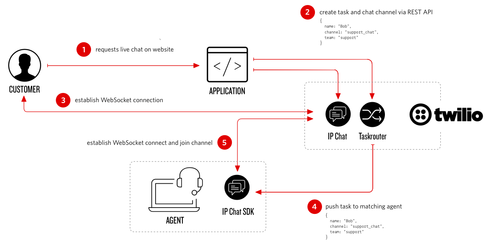

# Twilio Contact Center Demo
Essence of a modern contact center is to serve customers on multiple channels (voice, IP messaging, video, SMS, email, social media, etc.), allow them to move seamlessly across channels and most importantly maintain context of the conversations.

The Twilio Contact Center demo is reference architecture for building a modern contact center. The focus of the demo is to show how to build a Twilio platform based contact center and the various backend and frontend components needed.

**Note:** We have done the basic work from an UX perspective and lot of opportunities remains to improve on it. Application security implementation is minimal as well in the demo.

This application is provided as-is.  Twilio does not officially support it.

# Features
* Twilio Account
* Twilio Phone Numbers
* Twilio Voice (PSTN, Twilio WebRTC Client)
* Twilio IP Messaging
* Twilio TaskRouter
* Twilio REST APIs

# Customer Journey Flows:
## Voice Calling (Callback over PSTN):
Customer fills out online call request form -> Customer request detected -> TaskRouter -> Find Available Agent -> Dial Customer Out (PSTN) -> Connect Customer to awaiting Agent (WebRTC)



## Voice Calling (PSTN):
Customer Calls (PSTN) ->Twilio phone number -> Customer request detected -> IVR -> TaskRouter -> Find Available Agent -> Connect to Agent (WebRTC)



## Web Chat:
Customer Fill out online web chat request form -> Customer request detected -> TaskRouter -> Find Available Agent -> Start web chat between Customer and Agent (IP Messaging)



## Video Chat (future):
Customer Fill out online video chat request form -> Customer request detected -> TaskRouter -> Find Available Agent -> Start video chat between Agent and Customer (Video)

## Operational Analytics/Dashboard (future):
Real-time display of operational contact center metrics (for example: average call handle time, agent productivity, call metrics, TaskRouter stats, and more etc.) 

## Pre-requisites:
* Basic of Twilio platform - [Twilio \<Skills\>](https://twilio.radicalskills.com/), an elearning platform that provides a guided path for getting started with Twilio.
* [Twilio TaskRouter](https://www.twilio.com/docs/quickstart/ruby/taskrouter)
* [Twilio Client](https://www.twilio.com/docs/quickstart/ruby/client)
* [Twilio IP Messaging](https://www.twilio.com/docs/api/ip-messaging/guides/quickstart-js)
* Working knowledge of Angular.js, Bootstrap and Node.js

# Installation

Before you start the install, you’ll need the following variables from the Twilio Account Portal. If you haven't used Twilio before, welcome! You'll need to [Sign up for a Twilio account](https://www.twilio.com/try-twilio).

We recommend you create a separate sub-account within Twilio and install this app using that sub-accoount credentials.

**Note:** It is recommended that you have an upgraded Twilio account to fully experience this demo.

* For Account SID and Auth Token please click here:  https://www.twilio.com/console
* Buy a phone number or use an existing one (the application will configure the number for you later)
* Create a new Twilio [TaskRouter Workspace](https://www.twilio.com/user/account/taskrouter/workspaces)
* For creating a new IP Messaging Service or re-using an existing one, click here: https://www.twilio.com/console/ip-messaging/services
* For Twilio API Key and Twilio API Secret, click here: https://www.twilio.com/console/ip-messaging/dev-tools/testing-tools

## One Click Install - Heroku

This will install the application and all the dependencies on Heroku (login required) for you. As part of the installation, the Heroku app will walk you through configuration of environment variables.  Please click on the following button to deploy the application.

[](https://heroku.com/deploy?template=https://github.com/nash-md/twilio-contact-center)

After the installation has completed please open `https://<your_application_name>.herokuapp.com/setup` and configure the application. The demo overview will be accessible at `https://<your_application_name>.herokuapp.com`. 

## Manual Install - On Your Own Server

Fork and clone the repository. Then, install dependencies with

`npm install`

In order to run the demo you will need to set the following environment variables:

- `TWILIO_ACCOUNT_SID`
- `TWILIO_AUTH_TOKEN`
- `TWILIO_WORKSPACE_SID`

For web chat you need to set Twilio IP Messaging environment variables:

- `TWILIO_IPM_SERVICE_SID`
- `TWILIO_API_KEY`
- `TWILIO_API_SECRET`

Start the application

`node app.js`

Before you can use the demo please open `http://<your_application_name>/setup` and configure the application. The demo overview will be accessible at `http://<your_application_name>`. Please note, if process.env.PORT is not set the applications runs on port 5000.

**Note:** On Google Chrome a secure HTTPS connection is required to do phone calls via WebRTC. Use a tunnel that supports HTTPS such as ngrok, which can forward the traffic to your webserver.

# Contributions

Contributions are welcome and generally accepted. For not trivial amendments it is a good idea to submit an issue explaining the proposed changes before a PR. This allows the maintainers to give guidance and avoid you doing duplicated work.

Your changes must adhere a common project code style.

```
# please run this before "git commit"
npm run lint
# try automatic fix
./node_modules/.bin/eslint controllers --fix
./node_modules/.bin/eslint public --fix
```

To make life easier for other contributors and reviewer please rebase your commit in the same PR

```
git rebase -i HEAD^^^^^^
# then squash or fixup your shards
# and force push into your fork
git push origin [YOUR BRANCH] -f
```


# License

MIT

