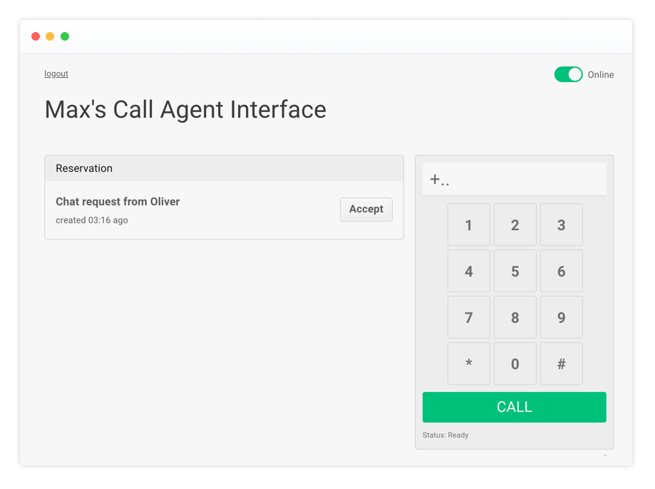

# Twilio Contact Center Demo

Essence of a modern contact center is to serve customers on multiple channels (voice, web chat, video, email, social media, etc.), allow them to move seamlessly across channels and most importantly maintain context of the conversations.

The Twilio Contact Center demo is reference architecture for building a modern contact center. The focus of the demo is to show how to build a Twilio platform based contact center and the various backend and frontend components needed.



**Note:** We have done the basic work from an UX perspective and lot of opportunities remains to improve on it. It has been designed for demo purposes and has not been separately security checked.

This application is provided as-is. Twilio does not officially support it.

# Features

- Twilio Phone Numbers
- Twilio Programmable Voice (PSTN, Twilio WebRTC Client)
- Twilio Programmable Chat
- Twilio Programmable SMS and Facebook Messenger
- Twilio Programmable Video
- Twilio TaskRouter
- Twilio REST APIs

# Customer Journey Flows:

## Callback Voice Calling (PSTN):

Customer fills out online call request -> Form submitted to server -> Task on TaskRouter created -> Find available and matching agent -> Agent accepts reservation and dials customer out (PSTN) -> Connect customer to agent (WebRTC)


## Inbound Voice Calling (PSTN):

Customer calls Twilio phone number -> Twilio requests webhook -> Server generates TwiML for IVR -> Caller selects IVR option -> Task on TaskRouter created -> Find available and matching agent -> Agent accepts reservation -> Connect customer to agent (WebRTC)


## Web Chat:

Customer fills out online web chat request form -> Form submitted to server -> Task on TaskRouter created -> Find available and matching agent -> Agent accepts reservation -> Start chat between customer and agent


## Video Call:

Customer fills out video call request form -> Form submitted to server -> Task on TaskRouter and video room created -> Find available and matching agent -> Agent accepts reservation -> Agent joins video room


## Real-time TaskRouter Events Dashboard:

Real-time display of operational contact center metrics (for example: average call handle time, agent productivity, call metrics, TaskRouter stats, and more etc.). Please check out the following repo: https://github.com/ameerbadri/twilio-taskrouter-realtime-dashboard

## Pre-requisites:

- Basic knowledge of Twilio platform - [TwilioQuest](https://www.twilio.com/quest/), an interactive, self-paced game where you learn how to Twilio.
- [Twilio TaskRouter](https://www.twilio.com/docs/quickstart/ruby/taskrouter)
- [Twilio Client](https://www.twilio.com/docs/quickstart/ruby/client)
- [Twilio Programmable Chat](https://www.twilio.com/docs/api/chat)
- [Twilio Programmable Video](https://www.twilio.com/docs/api/video/getting-started)
- Working knowledge of Angular.js, Bootstrap and Node.js

# Installation

If you haven't used Twilio before, welcome! You'll need to [Sign up for a Twilio account](https://www.twilio.com/try-twilio).

We recommend you create a separate project within Twilio and install this app using that project.

**Note:** It is recommended that you have an upgraded Twilio account to fully experience this demo.

## Configuration Variables

Before you start the install, you’ll need to collect the following variables from the Twilio Account Portal.

- `TWILIO_ACCOUNT_SID`
- `TWILIO_AUTH_TOKEN`
- `TWILIO_WORKSPACE_SID`

* For Account SID and Auth Token please click here: https://www.twilio.com/console
* Buy a phone number or use an existing one (the application will configure the number for you later)
* Create a new Twilio [TaskRouter Workspace](https://www.twilio.com/user/account/taskrouter/workspaces) and select the custom template.

* For Twilio API Key SID and Twilio API Key Secret, click here: https://www.twilio.com/console/dev-tools/api-keys

- `TWILIO_API_KEY_SID`
- `TWILIO_API_KEY_SECRET`

For web chat you need to set Twilio Programmable Chat environment variables:

- `TWILIO_CHAT_SERVICE_SID`

* For creating a new Chat Services or re-using an existing one, click here: https://www.twilio.com/console/chat/services

The agent UI does not support handling of multiple tasks simultaneously, hence all tasks are routed on the same task channel with capacity of one simultaneous task. For more details please check [TaskRouter Multitasking](https://www.twilio.com/docs/taskrouter/multitasking)

- For outbound calls enable AGENT CONFERENCE setting, click here: https://www.twilio.com/console/voice/conferences/settings

## Terraform Install - Heroku

You can deploy this project with all depencendies on Heroku with Terraform, an open-source infrastructure as code software tool.

Create the API key for Heroku, check the [Heroku Platform API Guide](https://devcenter.heroku.com/articles/platform-api-quickstart) for help.

Add the Heroku API key and your email address to `terraform.tfvars`.

Initialize the Terraform configuration files and run

`terraform init`

If you have not installed Terraform, follow the [Terraform Getting Started](https://learn.hashicorp.com/terraform/getting-started/install.html).

Add the Twilio variables listed in section [Configuration Variables](#configuration-variables) to the `terraform.tfvars` variables file.

Set your Heroku application name in the infrastructure description file `terraform_heroku.tf`

Create an execution plan

`terraform plan`

Install the project on Heroku by executing

`terraform apply`

After the installation has completed please open `https://<your-application-name>.herokuapp.com/setup` and configure the application. The demo overview will be accessible at `https://<your-application-name>.herokuapp.com`.

## One Click Install - Heroku

This will install the application and all the dependencies on Heroku (login required) for you. As part of the installation, the Heroku app will walk you through configuration of environment variables. Please click on the following button to deploy the application.

[](https://heroku.com/deploy?template=https://github.com/nash-md/twilio-contact-center)

After the installation has completed please open `https://<your-application-name>.herokuapp.com/setup` and configure the application. The demo overview will be accessible at `https://<your-application-name>.herokuapp.com`.

## Google App Engine Installation

Download and install the [Google Cloud SDK](https://cloud.google.com/appengine/docs/standard/nodejs/quickstart).

Create a new project

`gcloud projects create <your-project-id> --set-as-default`

Initialize your App Engine app with your project and choose its region:

`gcloud app create --project=<your-project-id>`

Add the Twilio variables listed in section [Configuration Variables](#configuration-variables) to the `app.yaml` variables file.

Deploy the app on App Engine by running the following command.

`gcloud app deploy`

To view your application run

`gcloud app browse`

After the installation has completed please open `https://<your-project-id>.appspot.com/setup` and configure the application. The demo overview will be accessible at `https://<your-project-id>.appspot.com`.

## Manual Install - On Your Own Server

Fork and clone the repository. Then, install dependencies with

`npm install`

If you want to load environment variables from a file, install dotenv package to handle local environment variables.

`npm install dotenv`

In the root directory create a file called '.env', then add the following to top of app.js

`require('dotenv').config()`

In order to run the demo you will need to set the environment variables liste in Configuration Variables](#configuration-variables)

Start the application

`npm start`

Before you can use the demo please open `http://<your-application-name>/setup` and configure the application. The demo overview will be accessible at `http://<your-application-name>`. Please note, if process.env.PORT is not set the applications runs on port 5000.

If you are running the demo locally please remember that Twilio needs a publically-accessible address for webhooks, and the setup process registers these with Twilio. As such, you'll need to run something like ngrok instead of just hitting http://localhost:5000/. As you get new addresses from ngrok you'll need to also rerun the setup process to register the updated address with Twilio.

**ngrok Setup**

- System Wide Install

  - [Download and install from ngrok](https://ngrok.com/download)
  - Install with NPM `npm install ngrok -g`
  - Run ngrok (if PORT is defined in your .env update accordingly)

    `./ngrok http 5000`

- Project Only Install

  - Install ngrok package

    `npm install ngrok --dev`

  - Add the following to the top of app.js

    ```
    const ngrok = require('ngrok')

    const ngrokUrl = async function () {
     	const url = await ngrok.connect((process.env.PORT || 5000))
     	console.log('ngrok url ->', url)
    }

    ```

  - In app.js call ngrokUrl in app.listen to log the ngrok url on server spin up

    `ngrokUrl()`

**Note:** On Google Chrome a secure HTTPS connection is required to do phone calls via WebRTC. Use a tunnel that supports HTTPS such as ngrok, which can forward the traffic to your webserver.

# Contributions

Contributions are welcome and generally accepted. For not trivial amendments it is a good idea to submit an issue explaining the proposed changes before a PR. This allows the maintainers to give guidance and avoid you doing duplicated work.

Your changes must adhere a common project code style.

```
# please run this before "git commit"
npm run lint
# try automatic fix
./node_modules/.bin/eslint controllers --fix
./node_modules/.bin/eslint public --fix
```

To make life easier for other contributors and reviewer please rebase your commit in the same PR

```
git rebase -i HEAD^^^^^^
# then squash or fixup your shards
# and force push into your fork
git push origin [YOUR BRANCH] -f
```

# Have a question?

You can follow me on Twitter - [@mdamm_de](https://twitter.com/mdamm_de)

# License

MIT
